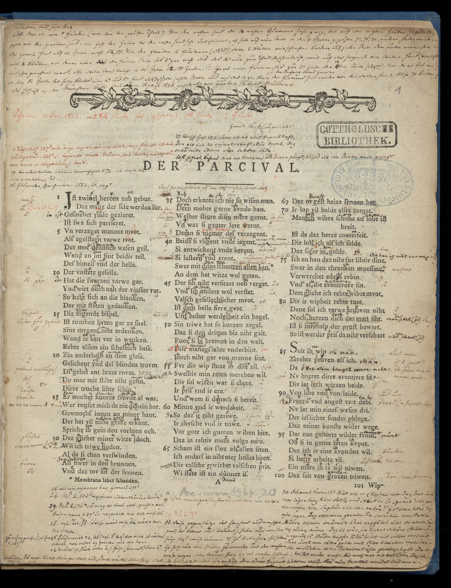

<!--

author:   Richard Diebel, Swantje Piotrowski, André Dietrich, Sebastian Zug

email:    diebel@ub.uni-kiel.de

version:  0.0.1

language: de

dark: false

icon:     /img/cau-norm-de-lilagrey-rgb.svg

-->

# Zum Projekt

<iframe src="https://www.datamanagement.uni-kiel.de/de/aktivitaeten/projekte/Projekt_DH-Bausteine/modulare-bausteine-geisteswissenschaften-team" style="border:0px;width:100%;height:500px" allowfullscreen="true" webkitallowfullscreen="true" mozallowfullscreen="true"></iframe>

# Umfrage

 {{0-1}}
 *****************
[qr-code](https://www.oncoo.de/k417)

https://www.oncoo.de/k417

****************

 {{1-2}}
<iframe src="https://www.oncoo.de/t/k417" style="border:0px;width:100%;height:500px" allowfullscreen="true" webkitallowfullscreen="true" mozallowfullscreen="true"></iframe>

# Einleitung OER

## OER Vision

> {0-1}{Lehrende möchten motivierende, interaktive Lehrmaterialien realisieren.}
> {1-2}{Lehrende möchten motivierende, interaktive Lehrmaterialien mit einem überschaubaren Aufwand realisieren.}
> {2-3}{Lehrende möchten maximal motivierende, interaktive Lehrmaterialien mit einem überschaubaren Aufwand realisieren, die optimal auf die eigenen didaktischen Ziele abgestimmt sind.}

{{3}}
********************************************************************************

> Das kann er/sie natürlich alleine realisieren, aber ...

---------------------

**1. Muss er/sie sich über alle Inhalte selbst Gedanken machen**

**2. Muss er/sie sich erheblichen technischen Herausforderungen stellen**

---------------------

********************************************************************************

### Ausgangspunkt

{{0-1}}
>  **Open Courseware / Open Educational Resources** ... teaching, learning and
> research materials in any medium, digital or otherwise,that reside in the
> **public domain** or have been released under an open license that permits
> no-cost access, use, **adaptation** and **redistribution** by others with no or 4
> limited restrictions. Open licensing is built within the existing framework of
> intellectual property rights as defined by relevant international conventions
> and respects the authorship of the work
>
> -- UNESCO 2002 Forum on the Impact of Open Courseware for Higher Education in Developing Countries [(Link)](https://unesdoc.unesco.org/ark:/48223/pf0000128515)
  

{{1-2}}
| Anforderung                  | Bedeutung                                  |
| ---------------------------- | ------------------------------------------ |
| `verwahren/vervielfältigen ` | Download, Speicherung und Vervielfältigung |
| `verwenden`                  | Nutzung im Lernkontext                     |
| `verarbeiten`                | Umgestaltung und Adaption                  |
| `vermischen`                 | Kombination und Extraktion                 |
| `verbreiten`                 | (digitale) Publikation                     |

{{1-2}}
*_5 V-Freiheiten für Offenheit_ von Jöran Muuß-Merholz und Jörg Lohrer für [open-educational-ressources](https://open-educational-resources.de) - Transferstelle für OER*


{{2-3}}
*********************

__Kritik an der 5V Definiotion__

> _1. Die 5V Definition fokussiert das Open in OER lässt aber das Education beiseite._
>
> _2. Die Verwaltung und Auffindbarkeit von OER Inhalten ist dadurch nicht erfasst._

**********************

### Kritik am OER-Ansatz

| Ebene                               | Kernaussage                                                                             |
| ----------------------------------- | --------------------------------------------------------------------------------------- |
| Emotionale Einordnung               | "_Da kann ja jeder meine Arbeit für sich nutzen!_"                                      |
|                                     | "_Da kann mich ja jeder kontrollieren!_"                                                |
| Rechtliche Herausforderungen        | "_Ich verwende viele Grafiken, die bei deren Urheberrecht ich mir im besten Fall unsicher bin!_"                                                                                        |
| Auffindbarkeit                      | "_Ich finde keine Inhalte, die ich in meiner Lehre gewinnbringend integrieren kann!_"   |
| <!-- Style="color:red" --> Aufwand  | <!-- Style="color:red" --> "_Da muss man ja Informatik studiert haben!_"                |
| <!-- Style="color:red" -->Abdeckung | <!-- Style="color:red" -->"_Da fehlen mir aber die Schnittstellen für meine Tools XY!_" |

<!--
style="width: 100%; max-width: 860px; display: block; margin-left: auto; margin-right: auto;"
-->
```ascii

      Wunsch nach                                             Wunsch nach
  einfacher Umsetzung  -----------> Konflikt <----------- spezifischen Elementen
                                       |                       im Material
                                       |
                                       v
                              OER als Lösungsansatz

```

# OER Praxis

{{1}}
> 1. Materialien müssen transformierbar sein, um eine Wiederverwendung zu ermöglichen. (_Verarbeiten/Verwenden/Verbreiten_)
> 2. Materialien brauchen Metadaten, um auffindbar zu sein. (_Verbreiten_)
> 3. Materialien brauchen offenkundige Versionierungen (_Verwalten_)

{{2}}
__Offensichtlich brauchen wir Formate, die neben den positiven Aspekten von Textdarstellungen auch das erweiterte Set von Anforderungen abdecken.__

## LiaScript

{{1}}
LiaScript ist eine freie Erweiterung der Auszeichnungssprache [Markdown](https://de.wikipedia.org/wiki/Markdown). Mit LiaScript lassen sich interaktive und ansprechende Lehr- und Lehrinhalte erstellen, die ohne die Verwendung eines Servers im Netz verbreitet werden können.

{{2}}
********
LiaScript erfüllt die oben genannten Anforderungen:

> 1. Materialien müssen transformierbar sein, um eine Wiederverwendung zu ermöglichen. (_Verarbeiten/Verwenden/Verbreiten_) --> LiaScript kann in andere Formate wie PDF, Docx, HTML, SCORM u.v.m konvertiert werden
> 2. Materialien brauchen Metadaten, um auffindbar zu sein. (_Verbreiten_) --> LiaScript kann einen Metadatenblock am Anfang jedes Dokuments enthalten, der es auffindbar macht
> 3. Materialien brauchen offenkundige Versionierungen (_Verwalten_) --> LiaScript ist als einfaches Textformat über Git lückenlos Versionierbar
********

{{3}}
********
Und weitere:

> 1. Einfache Syntax (_Verarbeiten/Vermischen/Verbreiten_)
> 2. Serverloses Hosten (_Verbreiten_) 
> 3. Multimedialität und Interaktivität durch Medien und interaktive Elemente  (_Education_)

********

## Beispiel Digitale Edition

### Einleitung

{{1-2}}

Im Sommer 1824 unternahm Karl Lachmann eine Bibliotheksreise zu den Standorten wichtiger Parzivalhandschriften. Er hatte dafür eine Beurlaubung von seiner Funktion als außerordentlicher Professor an der Universität Königsberg erwirkt. Sein Ziel war es, möglichst viele Parzivalhandschriften einzusehen. 
Als Arbeitshilfe hatte er den Abdruck des Parzival D (Sankt Gallen, Cod. 857) in der Ausgabe von Christoph Heinrich Myller von 1784 mit im Gepäck:

{{2}}
***********
In Sankt Gallen trug Lachmann die Abweichungen der Myllerschen Ausgabe vom Original in rot in den Druck ein. Dann reiste er weiter nach München und ergänzte die Lesarten der Handschrift G (München, Cgm 19) in schwarzer Tinte.

, dass in der Handschrift 'nimer' anstelle von 'niemer' steht. Das gleiche macht er in schwarzer Tinte für Lesarten der Handschrift D, wie etwa bei 'Beide', welches er in D als 'Beidiu' liest.")

Das Beispiel zeigt, wie die Art zu Edieren maßgeblich durch die technischen Vorrausetzungen mitbestimmt wird.[^1] Lachmann hatte nur ein einziges Mal in seinem Leben Zugang zu den Originalhandschriften, da die Reisen von Königsberg nach Sankt Gallen, Heidelberg, München und an weitere Orte anstrengend und kostspielig waren. Das Notieren der Lesarten erfolgte mühsam per Hand in einer nicht fehlerfreien alten Druckausgabe der Sankt Galler Handschrift. Unter den gegebenen Umständen ist es verständlich, dass Lachmann aus der ihm zugänglichen Überlieferung einen einzigen "Original"-Text rekonstruierte und die Lesarten der Handschriften nur in einem Apparat zugänglich machte.

Heute haben sich die technischen Vorraussetzungen geändert. Handschriften können digital eingesehen werden, indem man auf die jeweiligen Webseiten der Bibliotheken geht. Texte können digital festgehalten werden und müssen nicht mehr per Hand bei Kerzenlicht geschrieben werden.

[^1]: Vgl. Gabriel Viehauser: Mittelalterliche Texte als Modellierungsaufgabe. Digitale Zugänge zur mittelhochdeutschen Literatur. In: Martin Fischer (Hg.):Digitale Methoden und Objekte in Forschung und Vermittlung der mediävistischen Disziplinen. Akten der Tagung Bamberg, 08.-10. November 2018. Bamberg 2020. S. 18.

*************

### Definition

Die digitale Edition definiert sich nach Patrick Sahle folgendermaßen:

> Eine digitale Edition ist dadurch bestimmt, dass sie die allgemeinen Anforderungen an eine wissenschaftliche Edition durch die Berücksichtigung der gegenwärtigen technischen Möglichkeiten und ihrer methodischen Implikationen erfüllt. Sie folgt einem „digitalen Paradigma“.[^1]
>
>-- Patrick Sahle

Im Prinzip ist eine digitale Edition eine Edition, die wie eine Buchedition den wissenschaftlichen Ansprüchen gerecht wird. Durch die modernen technischen Möglichkeiten lassen sich die Anforderungen an eine wissenschaftliche Edition jedoch kaum noch ohne den Einsatz dieser Möglichkeiten abdecken. Die digitalen Methoden werden also benötigt, um dem wissenschaftlichen Anspruch gerecht zu werden.

Eine Buchedition zu scannen und damit ins Digitale zu überführen genügt nicht. Eine digitalisierte Edition ist keine digitale Edition.

[^1]: Patrick Sahle: Digitale Editionsformen. Zum Umgang mit der Überlieferung unter den Bedingungen des Medienwandels. Teil 2: Befunde, Theorie und Methodik. Norderstedt 2013, S. 148.


### Digitale Edition

<iframe src="https://www.briefedition.alfred-escher.ch/home.html" style="border:0px;width:100%;height:500px" allowfullscreen="true" webkitallowfullscreen="true" mozallowfullscreen="true"></iframe>

### Paradigmen digitaler Editionen

{{0-1}}
*****************
> “[...] the digital medium will be the native medium of the
>scholarly edition of the future.”[^1]

Digitale Editionen folgen speziellen Paradigmen (dh. methodischen Leitvorstellungen), die stark von den technischen Rahmenbedingen abhängen in denen eine Edition entsteht. Im Eingangsbeispiel zu Karl Lachmanns Parzivaledition waren die Rahmenbedingungen eng gesteckt und auch das Produkt, welches am Ende herauskommen sollte. Ein Buch ist die Wiedergabe eines einmalig hergestellten Textes, der in Form und Länge unveränderbar ist. Es ist also mehr oder minder starr und geschlossen. Die hier vorgestellten Paradigmen können immer im Vergleich zu einer Buchedition gelesen werden, die nicht durch sie gekennzeichnet wird.

***************

{{1-2}}
**********
Digitale Editionen zeichnen sich grundsätzlich durch **Offenheit** aus. Durch die Verschiebung in das Digitale ist es im Vergleich zu einer Buchedition wesentlich leichter, "weitere Kontexte in eine Edition einzubeziehen"[^1]. Dies können weitere Texte sein, Metadaten, Bilder (Faksimiles) oder auch Kommentare. Die Möglichkeiten sind endlos und werden durch die technischen Rahmenbedingen kaum beschränkt, was auch zum Problem der Entgrenzung führen kann, wenn digitale Editionen zu viele Zusatzinformationen bereitstellen und so der Blick für den eigentlichen Gegenstand verloren geht. In einem hypothetischen Extrembeispiel könnte die Edition eines mittelalterlichen Textes alle Textzeugen, Übersetzungen und Kommentare einbeziehen und darüber das Lesen eines einzelnen Textzeugen erschweren. Digitale Editionen müssen daher ihren Gegenstand definieren, um sich aktiv zu begrenzen.

[^1]: Jannidis, Fotis, Hubertus Kohle, Malte Rehbein: Digital Humanities. Eine Einführung. Stuttgart 2017.

********

{{2-3}}
Ein weiteres Paradigma digitaler Editionen ist die **Multimedialität**. In Bucheditionen war es aus ökonomischen Gründen (Bild- und Farbdruck sind aufwendiger und teurer) schwierig, Bilder einzubinden. Im Digitalen lassen sich Bilder wesentlich leichter zur Anzeige bringen, weshalb viele digitale Editionen auf das Faksimile der entsprechenden Textzeugen einbinden. Ebenso leicht lassen sich Audiodateien einbinden, die einen Text möglicherweise vorlesen, was ihn zugänglicher macht.

{{3-4}}
Digitale Editionen sind leicht veränderbar. Die Arbeit an ihnen ist mehr ein **Prozess** als ein Hinarbeiten auf ein abgeschlossenes Produkt. In Bucheditionen markiert das gedruckte Buch den Endzustand aller editorischen Arbeiten. Für Änderungen muss eine weitere Auflage erstellt werden. Digitale Editionen unterliegen dieser Beschränkung nicht, sie können sehr leicht verändert werden. Dies ermöglicht es, die Ergebnisse bereits früh zu teilen und die Edition durch stetige Arbeit immer weiter zu verbessern. Auch spät erkannte Fehler können einfach korrigiert werden. Da sich die Edition dadurch stark ändern kann, kann die genaue Zitation eines bestimmten Zustands ein Problem darstellen - ähnlich der Zitation einer Website, bei der als Hilfskonstruktion das genaue Abrufdatum angegeben wird, uns in der Regel aber die Werkzeuge fehlen, diesen früheren Zustand der Seite aufzurufen.

{{4-5}}
Ein weiteres Paradigma digitaler Edition ist die **Modellierung** aller Textdaten. Modellierung meint hier, dass die Daten abstrahiert und in einer bestimmten Form festgehalten werden. Bei digitalen Editionen werden die Texte häufig in [TEI-XML](https://www.digitale-edition.at/o:konde.79) festgehalten. Dort werden die einzelnen Textbestandteile (Überschrift, Textblock, Strophe, Satz, Wort, Zeilenummer etc. etc.) mit Tags versehen, die den Inhalt des Textbestandteils genau bezeichnen. So sind alle Daten in einer Quelle vereint (Single-Source-Prinzip) und genau bezeichnet. Aus dieser einen Quelle lassen sich dann wiederum ganz unterschiedliche Endprodukte erzeugen. Also beispielsweise eine Edition mit oder ohne Übersetzungstext, eine ohne Übersetzung aber dafür mit Kommentaren oder eine, die alle verfügbaren Daten abbildet. Eine digitale Edition "[ist] von den Restriktionen der medialen Formgebung unabhängig" und zeigt insofern transmediales Potenzial [^2].

[^2]: Patrick Sahle: Digitale Editionsformen. Zum Umgang mit der Überlieferung unter den Bedingungen des Medienwandels. Teil 2: Befunde, Theorie und Methodik. Norderstedt 2013, S. 163.
{{5-6}}
Die **Interaktivität** lässt sich bei digitalen Editionen einfach erreichen. Da der gesamte Datenbestand vorliegt, lassen sich die Ansichten auch durch die Benutzer*innen steuern. Jeder kann so die Daten so darstellen lassen, wie sie für das jeweilige Forschungsinteresse am günstigsten sind. Ein Namensforscher könnte sich beispielsweise nur die Namen eines Textes anzeigen lassen und müsste sie nicht mühsam selbst im Text markieren.

# Übung

## Einrichtung

Sie benötigen einen Laptop/Tablet und den Liveeditor von Liascript:

https://liascript.github.io oder einfach LiaScript im Browser suchen

<iframe src="https://liascript.github.io" style="border:0px;width:100%;height:500px" allowfullscreen="true" webkitallowfullscreen="true" mozallowfullscreen="true"></iframe>

## Textstrukturierung

Überschriften werden durch eine einfache Raute erzeugt. Die Anzahl der Rauten bestimmt die Ordnung der Überschriften. Es muss ein Leerzeichen zwischen den Rauten und dem Überschriftentext sein.

Einfache Textblöcke werden unformatiert eingegeben. Sie müssen jedoch mit einer Leerzeile von anderen Blöcken getrennt sein.
Ohne Leerzeile wird ein Satz zum Block hinzugerechnet.

> Spitzklammern erzeugen einen farblich markierten Bereich, der der Hervorhebung von 
> Textblöcken dienen kann.

> "Fügt man einen abgesetzten und durch zwei Bindestriche markierten Urheber des Zitates und eine Leerzeile hinzu, wird der Textblock als Zitat hervorgehoben."
>
> -- Liascript Jünger 

Unterüberschriften innerhalb des Blocks
----

Große Unterüberschrift innerhalb des Blocks
====

----

Für eine durchgezogene Linie muss vor und nach den Bindestrichen ein Leerzeile bleiben.


## Textformatierung

_kursiv_ auch *kursiv*

__fett__ auch **fett**

___kursiv___ und ***fett***

~durchgestrichen~

~~unterstrichen~~

Text normal ^hochgestellter Text^

`unformatierter Code` zum Beispiel für Inline-Code `<title>Titel</title>`

## Multimedia

### Bilder

{{1-2}}
***************************

Verweis auf Externe Bilder:

``` html


```

Beispiel:


***********************

{{2}}
************************

Projektinterne Bilder:

``` html


```

**********************

### Audio

* Syntax: `?[ein Pferd](https://www.w3schools.com/html/horse.mp3 "höre ein Pferd wiehern")`
* Example:

  ?[ein Pferd](https://www.w3schools.com/html/horse.mp3 "höre ein Pferd wiehern")

### Video

**Movie-notation: `!?[alt-text](movie-url)`**

- YouTube: `!?[The Future of Programming](https://www.youtube.com/watch?v=8pTEmbeENF4)`

  !?[The Future of Programming](https://www.youtube.com/watch?v=8pTEmbeENF4)

- relative path: `!?[Something about math](vid/math.mp4)`

  !?[Something about math](vid/math.mp4)

- > # List of supported Video Platforms
  >
  > * [DailyMotion](https://www.dailymotion.com)
  > * [PeerTube](https://peertube.tv)
  > * [TeacherTube](https://TeacherTube.com)
  > * [Video TU-Freiberg](https://video.tu-freiberg.de)
  > * [Vimeo](https://Vimeo.com)
  > * [YouTube](https://YouTube.com)

### Code

``` js
let text = 'Hello, World';
text;
```
<script>
    @input
</script>

### Und mehr

[SketchFab](https://sketchfab.com): `??[Die Stadt Düren 1634](https://sketchfab.com/3d-models/dueren1634-citymodel-c-f1f1c5c63a484303b953621343c75075)`

  ??[Dueren 1634](https://sketchfab.com/3d-models/dueren1634-citymodel-c-f1f1c5c63a484303b953621343c75075)

## Animationen

    {{0}}
Wie in Powerpoint können Textblöcke der Reihe nach erscheinen. 

    {{1-3}}
Dieser Block kommt nach dem ersten Klick. Dies markiert man mit zwei geschweiften Klammern `{{in(-out)}}`, die in der Mitte durch Zahlen angeben, wann der Block erscheint und (optional) wann er wieder verschwindet.

    {{2-3}}
Dieser Block erscheint ab Schritt 2 und verschwindet bei 3, markiert durch `{{2-3}}`

    {{3}}
Um einen Block ab einem Schritt stehen zu lassen gibt man nur den entsprechenden Schritt als einzelne Zahl an. Dieser hier erscheint bei 3 und bleibt auch bei 4.

    {{3-4}}
Dieser Block kommt bei drei und geht bei 4, markiert durch `{{3-4}}`

    {{4}}
Dieser Block erscheint bei 4.

## Quizze

### Textquiz

Wie heißt die hier vorangestellte Sprache?

[[LiaScript]]

### Single Choice

Anzahl und Ordnung der Optionen ist beliebig.

[( )] Diese Wahl ist falsch.
[(X)] <-- __Richtig__
[( )] Auch falsch.

### Multiple Choice

Alle markierten Zeilen müssen ausgewählt werden:

[[ ]] nicht ausgewählt
[[X]] <-- __Richtig__
[[ ]] auch falsch.
[[X]] __auch Richtig__

### Matrix

Kombination von Single- und Multiple-Choice Quizzen:

[[Head 1] [_Head 2_] [**Head 3**]]
[  [X]        [ ]         [X]    ]  Weitere
[  ( )        (X)         ( )    ]  Zeilen...

### Hilfen

Hilfen können mit `[[?]]` an alle Quizze angehängt werden:

[[LiaScript]]
[[?]] Tipp 1
[[?]] Tipp 2
[[?]] ...

# Links

## Weiterführende Informationen zu LiaScript und OER
> **LiaScript:** https://liascript.github.io/

> **LiaScript Cheat Sheet:** https://aizac.herokuapp.com/liascript-cheet-sheet/

> **Liascript Live Editor:** https://liascript.github.io/LiveEditor

> **OER:** https://open-educational-resources.de

## Weiterführende Informationen zum Projekt
> **Zum Projekt:** https://www.datamanagement.uni-kiel.de/de/aktivitaeten/projekte/Projekt_DH-Bausteine/eLBB4RDM-Projekt

# Haben Sie Fragen?


