<!--

author:   Richard Diebel, Jana Fehr

email:    diebel@ub.uni-kiel.de

version:  0.0.1

language: de

narrator: German Female

icon:     /img/cau-norm-de-lilagrey-rgb.svg

-->

# Umfrage

<iframe src="https://answergarden.ch/3348444" style="border:0px;width:100%;height:500px" allowfullscreen="true" webkitallowfullscreen="true" mozallowfullscreen="true"></iframe>

# Einleitung OER

## OER Vision

> {0-1}{Lehrende möchten motivierende, interaktive Lehrmaterialien realisieren.}
> {1-2}{Lehrende möchten motivierende, interaktive Lehrmaterialien mit einem überschaubaren Aufwand realisieren.}
> {2-3}{Lehrende möchten maximal motivierende, interaktive Lehrmaterialien mit einem überschaubaren Aufwand realisieren, die optimal auf die eigenen didaktischen Ziele abgestimmt sind.}

{{3}}
********************************************************************************

> Das kann er/sie natürlich alleine realisieren, aber ...

---------------------

**1. Muss er/sie sich über alle Inhalte selbst Gedanken machen**

**2. Muss er/sie sich erheblichen technischen Herausforderungen stellen**

---------------------

********************************************************************************

### Ausgangspunkt

>  **Open Courseware / Open Educational Resources** ... teaching, learning and
> research materials in any medium, digital or otherwise,that reside in the
> **public domain** or have been released under an open license that permits
> no-cost access, use, **adaptation** and **redistribution** by others with no or 4
> limited restrictions. Open licensing is built within the existing framework of
> intellectual property rights as defined by relevant international conventions
> and respects the authorship of the work
>
> -- UNESCO 2002 Forum on the Impact of Open Courseware for Higher Education in Developing Countries [(Link)](https://unesdoc.unesco.org/ark:/48223/pf0000128515)

           {{0-1}}
********************************************************************************

| Anforderung                  | Bedeutung                                  |
| ---------------------------- | ------------------------------------------ |
| `verwahren/vervielfältigen ` | Download, Speicherung und Vervielfältigung |
| `verwenden`                  | Nutzung im Lernkontext                     |
| `verarbeiten`                | Umgestaltung und Adaption                  |
| `vermischen`                 | Kombination und Extraktion                 |
| `verbreiten`                 | (digitale) Publikation                     |


*_5 V-Freiheiten für Offenheit_ von Jöran Muuß-Merholz und Jörg Lohrer für [open-educational-ressources](https://open-educational-resources.de) - Transferstelle für OER*

> _OER können der Auslöser für Innovation und neue Lenrformen des 21. Jahrhunderts sein._
>
> -- _Handreichung OER - Der Einstieg in den Umgang mit Open Educational Ressources_, Bericht des Projektes OERsax, 2018

********************************************************************************


### Ideales OER Material - ein Textdokument

<!--
style="width: 100%; max-width: 860px; display: block; margin-left: auto; margin-right: auto;"
-->
```ascii

Kurs.txt         Version 1.0          Kurs.txt          Version 1.1
+--------------------------+          +---------------------------+
| Kurs  Deutsche Literatur |          | Kurs  Deutsche Literatur  |
| Autor Peter Muster       | "Fehler" | Autoren Peter Muster      |
|                          |------>   |         Angelika Maier    |----->
|~~~~~~~~~~~~~~~~~~~~~~~~~~|          |~~~~~~~~~~~~~~~~~~~~~~~~~~~|
| Ab 1756 bereiste Goethe  |---.      | Ab 1786 bereiste Goethe   |--.
| Italien ...              |   |      | Italien ...               |  |
                               |                                     |    Course.txt       Version 1.1.2
                               |                                     |    +----------------------------+
                               |                                     |    | Kurs  German Literature    |
                               |                                     |    | Autoren Peter Muster       |
                               |                                     .--> |         Angelika Maier     |
                               |                                          |         Steve Gray         |
                               |                                          |~~~~~~~~~~~~~~~~~~~~~~~~~~~~|
                               |                                          | In 1786 Goethe traveled to |
                               |                                          | Italy ...                  |
                               |      Kurs.txt         Version 1.0
                               |      +---------------------------+
                               |      | Kurs  Goethes Welt        |
                               |      | Autoren Peter Muster      |
                               .-->   |         Angelika Maier    |----->
                                      |~~~~~~~~~~~~~~~~~~~~~~~~~~~|
                                      | Während der italienischen |
                                      | Reise ...                 |
```
*Versionen der Lehrinhalte eines Kurses und deren Wiederverwendung in anderen Veranstaltungen*

{{0-1}}
********************************************************************************

| Anforderung                  | txt |                                                          |
| ---------------------------- | --- | -------------------------------------------------------- |
| `verwahren/vervielfältigen ` | ++  | vorteilhaft wegen geringer Größe                         |
| `verwenden`                  | +   | analoge / digitale Verteilung an Studieren unkompliziert |
| `verarbeiten`                | ++  | verarbeitbar ohne zusätzliche Software                   |
| `vermischen`                 | ++  | einfache Kombination von Textfragmenten per Copy&Paste   |
| `verbreiten`                 | ++  | gut exportierbar                                         |

> **Moment, ein reines Textdokument ist als OER Inhalt perfekt?**

********************************************************************************

{{1-2}}
********************************************************************************

> _1. Die 5V Definition fokussiert das Open in OER lässt aber das Education beiseite._
>
> _2. Die Verwaltung und Auffindbarkeit von OER Inhalten ist dadurch nicht erfasst._

| Anforderung                                           | txt                           |                                                          |
| ----------------------------------------------------- | ----------------------------- | -------------------------------------------------------- |
| `verwahren/vervielfältigen `                          | ++                            | vorteilhaft wegen geringer Größe                         |
| `verwenden`                                           | +                             | analoge / digitale Verteilung an Studieren unkompliziert |
| `verarbeiten`                                         | ++                            | verarbeitbar ohne zusätzliche Software                   |
| `vermischen`                                          | ++                            | einfache Kombination von Textfragmenten per Copy&Paste   |
| `verbreiten`                                          | ++                            | gut exportierbar                                         |
| <!-- Style="color:green" --> verwalten / versionieren | ++                            |                                                          |
| <!-- Style="color:green" -->   motivieren             | <!-- Style="color:red" --> -- | keine zeitgemäßen Formate und interaktiven Inhalte       |

> __Offensichtlich brauchen wir Formate, die neben den positiven Aspekten von Textdarstellungen auch das erweiterte Set von Anforderungen abdecken.__

********************************************************************************

### Kritik am OER-Ansatz

| Ebene                               | Kernaussage                                                                             |
| ----------------------------------- | --------------------------------------------------------------------------------------- |
| Emotionale Einordnung               | "_Da kann ja jeder meine Arbeit für sich nutzen!_"                                      |
|                                     | "_Da kann mich ja jeder kontrollieren!_"                                                |
| Rechtliche Herausforderungen        | "_Ich verwende viele Grafiken, die bei deren Urheberrecht ich mir im besten Fall unsicher bin!_"                                                                                        |
| Auffindbarkeit                      | "_Ich finde keine Inhalte, die ich in meiner Lehre gewinnbringend integrieren kann!_"   |
| <!-- Style="color:red" --> Aufwand  | <!-- Style="color:red" --> "_Da muss man ja Informatik studiert haben!_"                |
| <!-- Style="color:red" -->Abdeckung | <!-- Style="color:red" -->"_Da fehlen mir aber die Schnittstellen für meine Tools XY!_" |

<!--
style="width: 100%; max-width: 860px; display: block; margin-left: auto; margin-right: auto;"
-->
```ascii

      Wunsch nach                                             Wunsch nach
  einfacher Umsetzung  -----------> Konflikt <----------- spezifischen Elementen
                                       |                       im Material
                                       |
                                       v
                              OER als Lösungsansatz

```

# OER Praxis

> 1. Materialien müssen transformierbar sein, um eine Wiederverwendung zu ermöglichen. (_Verarbeiten/Verwenden/Verbreiten_)
> 2. Materialien brauchen Metadaten, um auffindbar zu sein. (_Verbreiten_)
> 3. Materialien brauchen offenkundige Versionierungen (_Verwalten_)

<!--
style="width: 100%; max-width: 860px; display: block; margin-left: auto; margin-right: auto;"
-->
```ascii
+------------------+
| # Digital Systems|\                                      .-----------.
| (SoSe 2021)      +-+                              ╔══════|   LMS  X  |══════╗
|                    |  --------------------------> ║      '-----------'      ║
| ## Task 1          |                              ║ Digital Systems 2021    ║
|                    |                              ║                         ║
| + Implement ...    | --------------+              ║ import numpy as np      ║
|                    |    Trans-     |              ║ ...                     ║
|                    |    formation  |              ╚═════════════════════════╝
+--------------------+               v
                                .-,(   ),-.                .-----------.
Lizenz: ...                  .-(           )-.      ╔══════|   LMS  Y  |══════╗
Inhalt: ...                 (    OER Cloud    )     ║      '-----------'      ║
Autor: ...                   '-(           )-'  +-->║ Digital Systems 2021    ║
Versionshistorie: ...           '-.(   ).-'     |   ║                         ║
                                     |          |
                                     +----------+          .-----------.
                                                |   ╔══════|  Webapp   |══════╗
                                                |   ║      '-----------'      ║
                                                +-->║ Digital Systems 2021    ║
                                                    ║                         ║

```
*Transformation von OER Materialien für die Verwendung in verschiedenen LMS*

# Einleitung

## Lachmann

<div style="text-align: justify"> Im Sommer 1824 unternahm Karl Lachmann eine Bibliotheksreise zu den Standorten wichtiger Parzivalhandschriften. Er hatte dafür eine Beurlaubung von seiner Funktion als außerordentlicher Professor an der Universität Königsberg erwirkt. Sein Ziel war es, möglichst viele Parzivalhandschriften einzusehen. 
Als Arbeitshilfe hatte er den Abdruck des Parzival D (Sankt Gallen, Cod. 857) in der Ausgabe von Christoph Heinrich Myller von 1784 mit im Gepäck: </div>


In Sankt Gallen trug Lachmann die Abweichungen der Myllerschen Ausgabe vom Original in rot in den Druck ein. Dann reiste er weiter nach München und ergänzte die Lesarten der Handschrift G (München, Cgm 19) in schwarzer Tinte.

, dass in der Handschrift 'nimer' anstelle von 'niemer' steht. Das gleiche macht er in schwarzer Tinte für Lesarten der Handschrift D, wie etwa bei 'Beide', welches er in D als 'Beidiu' liest.")

<div style="text-align: justify"> Das Beispiel zeigt, wie die Art zu Edieren maßgeblich durch die technischen Vorrausetzungen mitbestimmt wird.[^1] Lachmann hatte nur ein einziges Mal in seinem Leben Zugang zu den Originalhandschriften, da die Reisen von Königsberg nach Sankt Gallen, Heidelberg, München und an weitere Orte anstrengend und kostspielig waren. Das Notieren der Lesarten erfolgte mühsam per Hand in einer nicht fehlerfreien alten Druckausgabe der Sankt Galler Handschrift. Unter den gegebenen Umständen ist es verständlich, dass Lachmann aus der ihm zugänglichen Überlieferung einen einzigen "Original"-Text rekonstruierte und die Lesarten der Handschriften nur in einem Apparat zugänglich machte. </div>


<div style="text-align: justify">Heute haben sich die technischen Vorraussetzungen geändert. Handschriften können digital eingesehen werden, indem man auf die jeweiligen Webseiten der Bibliotheken geht. Texte können digital festgehalten werden und müssen nicht mehr per Hand bei Kerzenlicht geschrieben werden.</div>

[^1]: Vgl. Gabriel Viehauser: Mittelalterliche Texte als Modellierungsaufgabe. Digitale Zugänge zur mittelhochdeutschen Literatur. In: Martin Fischer (Hg.):Digitale Methoden und Objekte in Forschung und Vermittlung der mediävistischen Disziplinen. Akten der Tagung Bamberg, 08.-10. November 2018. Bamberg 2020. S. 18.

## Definition

Die digitale Edition definiert sich nach Patrick Sahle folgendermaßen:

> Eine digitale Edition ist dadurch bestimmt, dass sie die allgemeinen Anforderungen an eine wissenschaftliche Edition durch die Berücksichtigung der gegenwärtigen technischen Möglichkeiten und ihrer methodischen Implikationen erfüllt. Sie folgt einem „digitalen Paradigma“.[^1]

<div style="text-align: justify"> Im Prinzip ist eine digitale Edition eine Edition, die wie eine Buchedition den wissenschaftlichen Ansprüchen gerecht wird. Durch die modernen technischen Möglichkeiten lassen sich die Anforderungen an eine wissenschaftliche Edition jedoch kaum noch ohne den Einsatz dieser Möglichkeiten abdecken. Die digitalen Methoden werden also benötigt, um dem wissenschaftlichen Anspruch gerecht zu werden.</div>


Eine Buchedition zu scannen und damit ins Digitale zu überführen genügt nicht. Eine digitalisierte Edition ist keine digitale Edition.

[^1]: Patrick Sahle: Digitale Editionsformen. Zum Umgang mit der Überlieferung unter den Bedingungen des Medienwandels. Teil 2: Befunde, Theorie und Methodik. Norderstedt 2013, S. 148.

## Parzivalprojekt

Die technischen Möglichkeiten haben sich seit Lachmanns Parzivalausgabe stark erweitert. Der Parzival liegt inzwischen in einer digitalen Edition vor, der anstelle eines Textes gleich vier Fassungen (\*D, \*m, \*G und \*T) synoptisch bereit stellt.[^Parzivalprojekt]

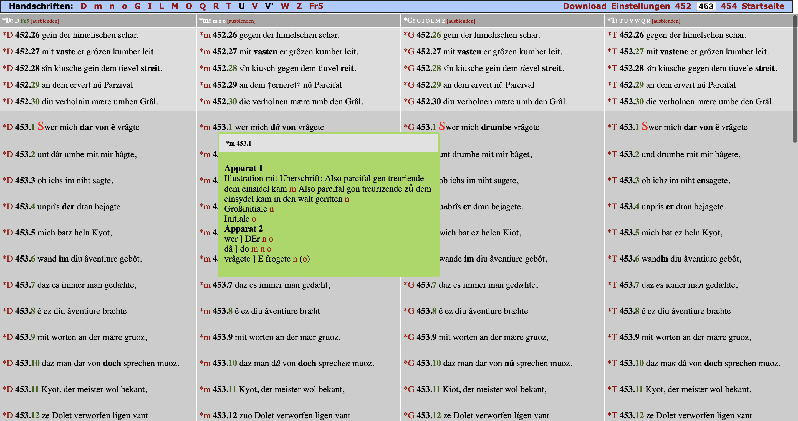

<div style="text-align: justify"> Die digitale Präsentation erlaubt es, alle vier Fassungen zeilengenau nebeneinander anzuzeigen. Die beiden Apparate werden zusätzlich eingeblendet, wenn man mit der Maus über den entsprechenden Vers geht. Die den Fassungen zugrundeliegenden Textzeugen sind ebenfalls digitalisiert und können zur Analyse hinzugezogen werden. Unterschiede zwischen den Fassungen sind fett markiert. </div>


<div style="text-align: justify"> Neben dem synoptischen Vergleich der vier Fassungen können auch Verssynopsen aller Texte, Einzelwortsuchen und Vergleiche von zwei Texten durchgeführt werden. </div>

[^Parzivalprojekt]: https://www.parzival.unibe.ch/

## Editionsprojekte

Im Folgenden werden weitere digitale Editionsprojekte vorgestellt, die für das Studium der Älteren deutschen Literatur von Interesse sind.
### Narrenschiff

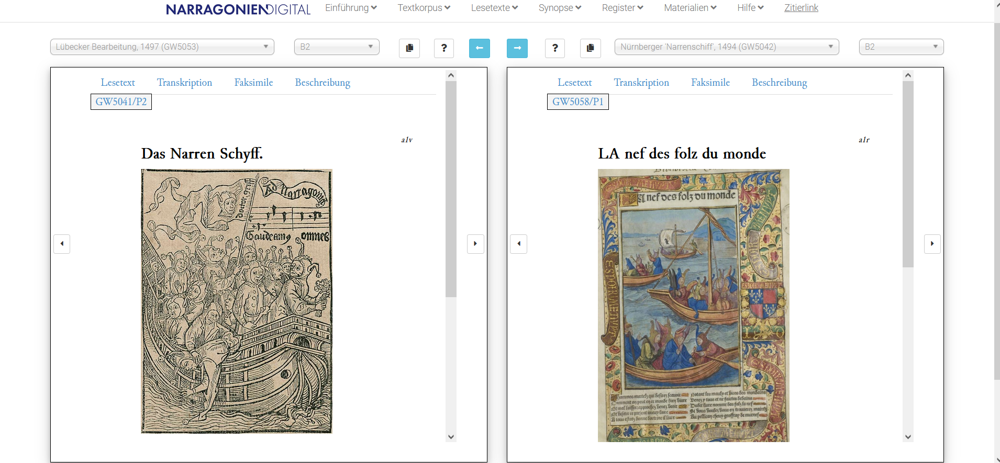 <div style="text-align: justify"> Am 10. Mai 2021, dem 500. Todestag des Verfassers, schaltete die Universität Würzburg die digitale Edition des erstmal 1494 erschienenen [*Narrenschiffes*](https://www.narragonien-digital.de/exist/index.html) von Sebastian Brandt frei. Hier können jeweils zwei, aus insgesamt 15 verschiedenen Editionen, synoptisch gegenübergestellt werden. </div>

### Der arme Heinrich - digital

<div style="text-align: justify"> [*Der arme Heinrich - digital*](https://digi.ub.uni-heidelberg.de/diglit/edition/ArmerHeinrich) ist eine aus der Zusammenarbeit der Universität Heidelberg und der Universidade Santiago de Compostela enstandene digitale Edition des gleichnamigen Versromans Hartmanns von Aue. Sie ermöglicht die synoptische Gegenüberstellung verschiedener Fassungen sowie derer Übersetzungen. </div>

??[Armer Heinrich](https://digi.ub.uni-heidelberg.de/diglit/edition/ArmerHeinrich "Der arme Heinrich - digital")

### Welscher Gast - digital

<div style="text-align: justify"> 1215/16 verfasst von Thomasin von Zerklaere fand der [*Welsche Gast*](https://digi.ub.uni-heidelberg.de/wgd/) über die nächsten Jahrhunderte weite Verbreitung. Heute sind noch 25 Handschriften bekannt. Die von der Universität Heidelberg hergestellte digitale Edition bietet die einzelne aber auch die synoptische Betrachtunng verschiedener Fassungen. </div>

??[Welscher Gast](https://digi.ub.uni-heidelberg.de/diglit/cpg389/0013/image,info,text_tei#col_info "Welscher Gast")

### Kaiserchronik - digital 

<div style="text-align: justify"> Für [Kaiserchronik Project](https://digi.ub.uni-heidelberg.de/de/kcd/index.html) der Universität Cambridge werden alle ca. 50 bekannten Handschriften der Kaiserchronik ediert. Nach Abschluss des Projekts soll die digitale Edition über die Universitätsbibliothek Heidelberg der Öffentlichkeit zur Verfügung gestellt werden. </div>

??[Kaiserchronik](https://digi.ub.uni-heidelberg.de/diglit/cpg361/0065/image,info,text_tei#col_text_tei "Kaiserchronik")

### Lyrik des deutschen Mittelalters - digital

<div style="text-align: justify"> Die digitale Edition [Lyrik des deutschen Mittelalters](http://www.ldm-digital.de/) der Universität Stuttgart enthält 5379 Strophen (59 Handschriften), die in jeglicher Kombination synoptisch gegenüber gestellt werden können. </div>

??[Lyrik](https://www.ldm-digital.de/show.php?au=Reinm&hs=A&str=56 "Lyrik des deutschen Mittelalters  - digital")

### Das Himmlische Gastmahl

<div style="text-align: justify"> [Das "Himmlische Gastmahl"](https://www.ilw.uni-stuttgart.de/abteilungen/germanistische-mediaevistik/forschung/digitale-editionen/start.html) ist eine digitale Edition einer Fassung der im Original vermutlich im 13. Jahrhundert verfassten gleichnamigen geistlichen Rede. Ersellt wurde sie von der Universität Stuttgart. </div>

??[Gastmahl](https://www.ilw.uni-stuttgart.de/abteilungen/germanistische-mediaevistik/forschung/digitale-editionen/hgast_txueb.html "Das himmlische Gastmahl")

### Meerwunder

<div style="text-align: justify"> Die digitale Edition des Heldenepos [Meerwunder](https://www.ilw.uni-stuttgart.de/abteilungen/germanistische-mediaevistik/forschung/digitale-editionen/meerwunder/start.html) wurde ebenfalls von der Universität Stuttgart erstellt. Sie biete die Edition, Übersetzung sowie Kommentierung dreier Fassungen der Erzählung. </div>

??[Meerwunder](https://www.ilw.uni-stuttgart.de/abteilungen/germanistische-mediaevistik/forschung/digitale-editionen/meerwunder/meermit.html "Meerwunder")


# Paradigmen digitaler Editionen

> “[...] the digital medium will be the native medium of the
>scholarly edition of the future.”[^1]

<div style="text-align: justify"> Digitale Editionen folgen speziellen Paradigmen (dh. methodischen Leitvorstellungen), die stark von den technischen Rahmenbedingen abhängen in denen eine Edition entsteht. Im Eingangsbeispiel zu Karl Lachmanns Parzivaledition waren die Rahmenbedingungen eng gesteckt und auch das Produkt, welches am Ende herauskommen sollte. Ein Buch ist die Wiedergabe eines einmalig hergestellten Textes, der in Form und Länge unveränderbar ist. Es ist also mehr oder minder starr und geschlossen. Die hier vorgestellten Paradigmen können immer im Vergleich zu einer Buchedition gelesen werden, die nicht durch sie gekennzeichnet wird. </div>


<div style="text-align: justify"> Digitale Editionen zeichnen sich grundsätzlich durch **Offenheit** aus. Durch die Verschiebung in das Digitale ist es im Vergleich zu einer Buchedition wesentlich leichter, "weitere Kontexte in eine Edition einzubeziehen"[^1]. Dies können weitere Texte sein, Metadaten, Bilder (Faksimiles) oder auch Kommentare. Die Möglichkeiten sind endlos und werden durch die technischen Rahmenbedingen kaum beschränkt, was auch zum Problem der Entgrenzung führen kann, wenn digitale Editionen zu viele Zusatzinformationen bereitstellen und so der Blick für den eigentlichen Gegenstand verloren geht. In einem hypothetischen Extrembeispiel könnte die Edition eines mittelalterlichen Textes alle Textzeugen, Übersetzungen und Kommentare einbeziehen und darüber das Lesen eines einzelnen Textzeugen erschweren. Digitale Editionen müssen daher ihren Gegenstand definieren, um sich aktiv zu begrenzen. </div>


<div style="text-align: justify"> Ein weiteres Paradigma digitaler Editionen ist die **Multimedialität**. In Bucheditionen war es aus ökonomischen Gründen (Bild- und Farbdruck sind aufwendiger und teurer) schwierig, Bilder einzubinden. Im Digitalen lassen sich Bilder wesentlich leichter zur Anzeige bringen, weshalb viele digitale Editionen auf das Faksimile der entsprechenden Textzeugen einbinden. Ebenso leicht lassen sich Audiodateien einbinden, die einen Text möglicherweise vorlesen, was ihn zugänglicher macht. </div>


<div style="text-align: justify"> Digitale Editionen sind leicht veränderbar. Die Arbeit an ihnen ist mehr ein **Prozess** als ein Hinarbeiten auf ein abgeschlossenes Produkt. In Bucheditionen markiert das gedruckte Buch den Endzustand aller editorischen Arbeiten. Für Änderungen muss eine weitere Auflage erstellt werden. Digitale Editionen unterliegen dieser Beschränkung nicht, sie können sehr leicht verändert werden. Dies ermöglicht es, die Ergebnisse bereits früh zu teilen und die Edition durch stetige Arbeit immer weiter zu verbessern. Auch spät erkannte Fehler können einfach korrigiert werden. Da sich die Edition dadurch stark ändern kann, kann die genaue Zitation eines bestimmten Zustands ein Problem darstellen - ähnlich der Zitation einer Website, bei der als Hilfskonstruktion das genaue Abrufdatum angegeben wird, uns in der Regel aber die Werkzeuge fehlen, diesen früheren Zustand der Seite aufzurufen. </div>

<div style="text-align: justify"> Ein weiteres Paradigma digitaler Edition ist die **Modellierung** aller Textdaten. Modellierung meint hier, dass die Daten abstrahiert und in einer bestimmten Form festgehalten werden. Bei digitalen Editionen werden die Texte häufig in [TEI-XML](https://www.digitale-edition.at/o:konde.79) festgehalten. Dort werden die einzelnen Textbestandteile (Überschrift, Textblock, Strophe, Satz, Wort, Zeilenummer etc. etc.) mit Tags versehen, die den Inhalt des Textbestandteils genau bezeichnen. So sind alle Daten in einer Quelle vereint (Single-Source-Prinzip) und genau bezeichnet. Aus dieser einen Quelle lassen sich dann wiederum ganz unterschiedliche Endprodukte erzeugen. Also beispielsweise eine Edition mit oder ohne Übersetzungstext, eine ohne Übersetzung aber dafür mit Kommentaren oder eine, die alle verfügbaren Daten abbildet. Eine digitale Edition "[ist] von den Restriktionen der medialen Formgebung unabhängig" und zeigt insofern transmediales Potenzial [^2]. </div>


<div style="text-align: justify"> Die **Interaktivität** lässt sich bei digitalen Editionen einfach erreichen. Da der gesamte Datenbestand vorliegt, lassen sich die Ansichten auch durch die Benutzer*innen steuern. Jeder kann so die Daten so darstellen lassen, wie sie für das jeweilige Forschungsinteresse am günstigsten sind. Ein Namensforscher könnte sich beispielsweise nur die Namen eines Textes anzeigen lassen und müsste sie nicht mühsam selbst im Text markieren. </div>

Grafische Darstellung
----------------

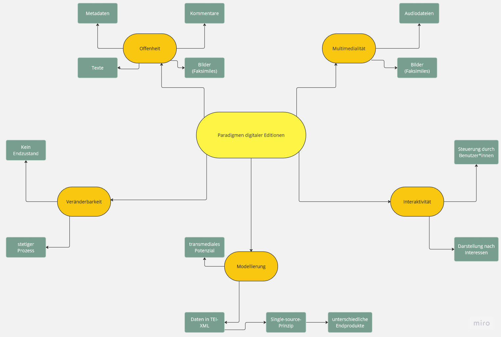

[^1]: Jannidis, Fotis, Hubertus Kohle, Malte Rehbein: Digital Humanities. Eine Einführung. Stuttgart 2017.
[^2]: Patrick Sahle: Digitale Editionsformen. Zum Umgang mit der Überlieferung unter den Bedingungen des Medienwandels. Teil 2: Befunde, Theorie und Methodik. Norderstedt 2013, S. 163.

## Vergleich

Beispiel herkömmliche Edition
------------

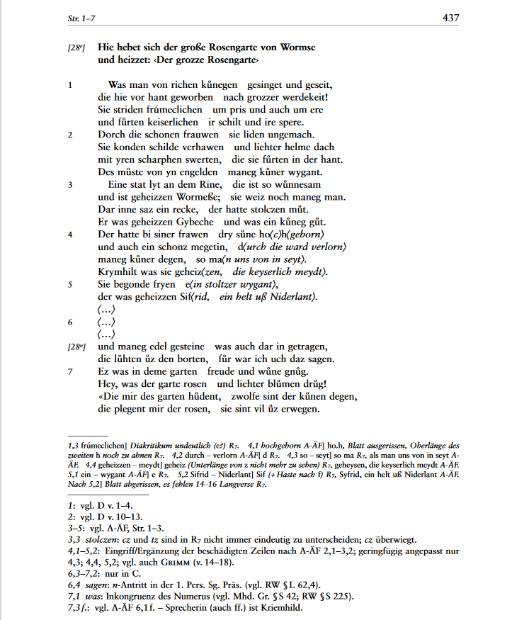 <div style="text-align: justify"> Hier ein Beispiel einer traditionellen Edition. Elisabeth Lienerts dreibändige Edition des _Rosengarten zu Worms_ enthält mehrere Fassungen des Heldenepos. Sie beginnt, indem sie Daten zu den verschiedenen Versionen und Fassungen angibt. Darauf folgen die Transkriptionen dieser. Daten und Transkriptionen werden also getrennt voneinander angegeben bzw. dargestellt. Immer zwei Textzeugen werden auf einem Doppelblatt nebeneinander gestellt. Der direkte Vergleich zweier Texte ist also möglich, jedoch vom physischen Raum des Buchformats auf zwei beschränkt. Die Lesarten der restlichen Textzeugen sind im Apparat vermerkt, der deshalb sehr umfangreich ausfällt. Einen Text aus dem Apparat zu rekonstruieren ist sehr mühsam. Der Text selbst ist aufgrund der Buchform nicht veränderbar. Es gibt keine Bilder der Originalhandschriften, da diese die Kosten und den Umfang der Ausgabe gesprengt hätten. Mögliche Fehler der Ausgabe könnten nur in einer zweiten Auflage korrigiert werden.</div> 

Beispiel digitale Edition 
-----------

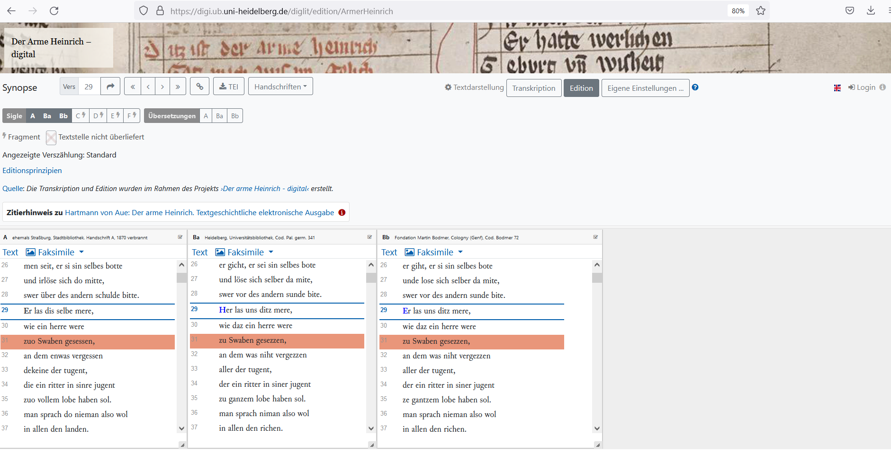 <div style="text-align: justify"> Die Universität Heidelberg und die Universidade Santiago de Compostela haben in Zusammenarbeit eine [digitale Edition von Hartmanns von Aue *Der arme Heinrich*](https://digi.ub.uni-heidelberg.de/diglit/edition/ArmerHeinrich) erstellt. Diese ermöglicht die parallele Darstellung verschiedener Fassungen und damit den direkten Vergleich dieser. </div>

Interaktivität
------------

 <div style="text-align: justify"> Über die sich im oberen Bereich des Bildschirms befindlichen Buttons können verschiedene Kriterien von dem oder der Nutzer*in kontrolliert werden. Hierbei handelt es sich also um ein Beispiel für die einfache Interaktivität digitaler Editionen. Auch die folgenden Merkmale sind beispielhaft für das für digitale Editionen typische Merkmal der einfachen Interaktivität. </div>

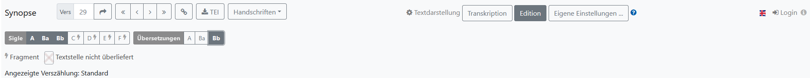

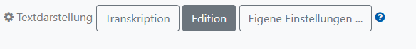 Der Text kann als Edition oder Transkription dargestellt werden.

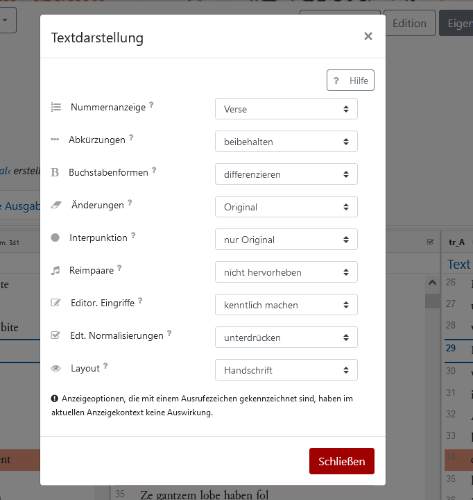 Zusätzlich gibt es die Möglichkeit eigene Einstellungen zu treffen.

Es können weitere Fassungen oder Übersetzungen hinzugefügt werden, um diese direkt miteinander zu vergleichen.

")

)")

Multimedialität 
-----

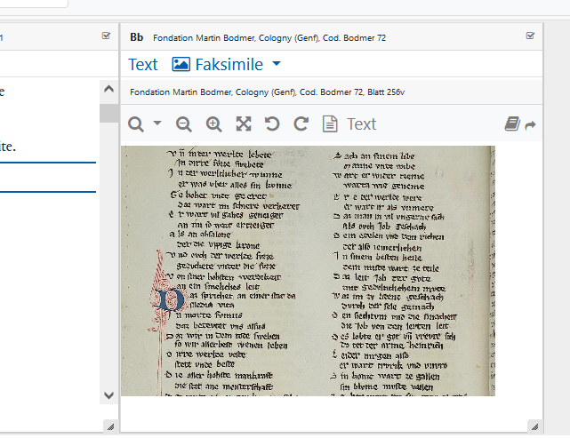 <div style="text-align: justify"> Die Einbindung von Faksimiles untersteht gleich zwei verschiedenen Paradigmen, dem der Multimedialität und dem der Offenheit, welche aber weiter unten angesprochen wird. Die Edition des *Armen Heinrich* ermöglicht auch die Darstellungen der Fassungen als Faksimile - der Button hierfür lässt sich über dem Text der Fassung finden. Audiodateien werden in dieser Edition nicht genutzt. </div>

Offenheit
-----------

Die Offenheit digitaler Editonen zeichnet sich bespielsweise durch die Nutzung von Kommentaren bzw. editorischen Hinweiseen aus. Diese werden durch ein Sternchen markiert und sind direkt verlinkt.

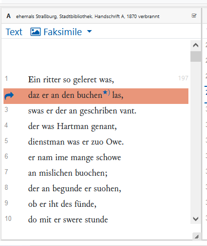
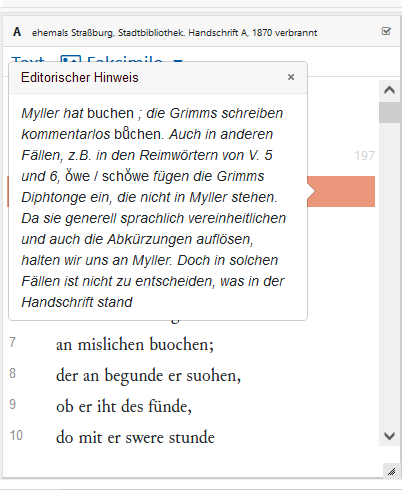
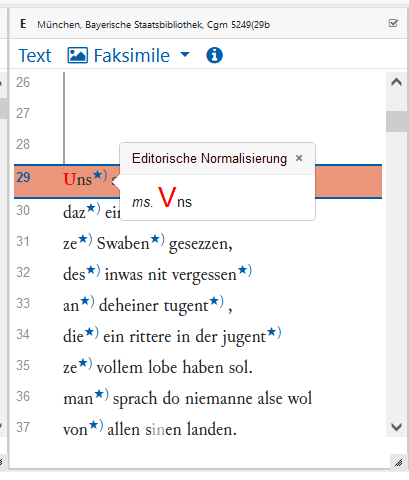

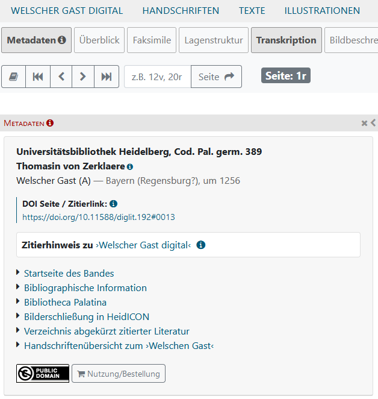 <div style="text-align: justify"> Auch die Angabe von Metadaten zählt unter dieses Paradigma. Diese fehlen in der Webpräsentation des _Armen Heinrich_, sind aber gewöhnlicherweise Teil der erstellten Quelldatei. Sie könnten wie nebenstehend dargestellt werden. Zu diesem Paradigma gehören auch die Einbindung von Faksimiles und weiteren Texten, die aber unter *Interaktivität* bereits besprochen worden. </div>

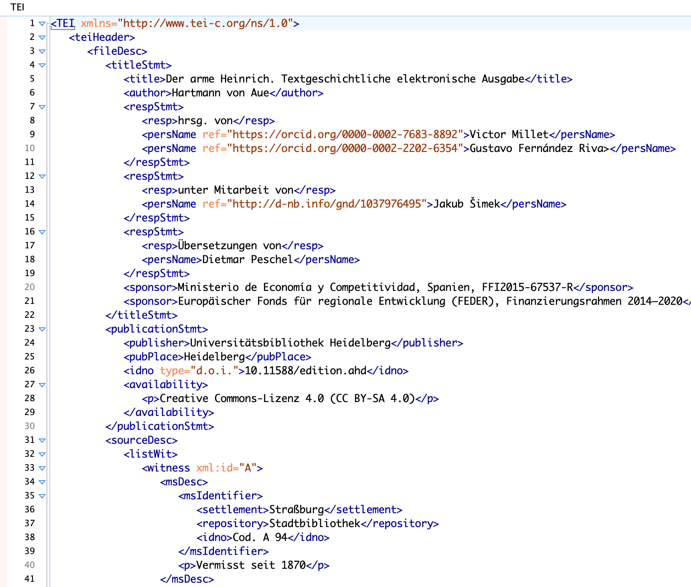

Veränderbarkeit
---------

<div style="text-align: justify"> Zwar lief das Projekt zur Erstellung der digitalen Edition im Januar 2019 aus, es könnte aber theoretisch immer weiter an ihr gearbeitet werden. Diese Eigenschaft der einfachen Veränderbarkeit und eines ausbleibenden Endzustandes ist jeder digitalen Edition durch ihr Medium inhärent. </div>


Modellierung
-----------

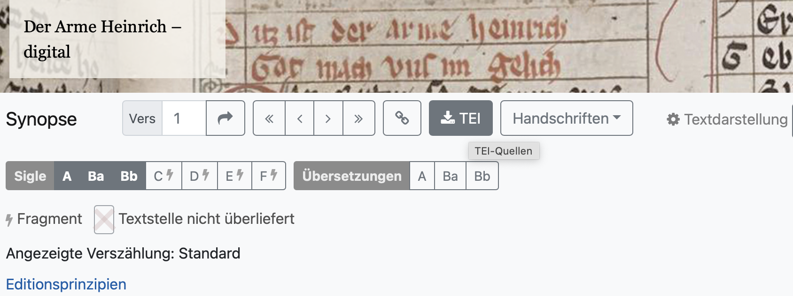

<div style="text-align: justify"> Die Textzeugen des Armen Heinrich sind alle in einer einzigen Datei zusammengefasst. Diese ist als TEI-XML über die Seite der digitalen Edition downloadbar. Für die Erstellung der Datei sind die Textzeugen analysiert und modelliert worden. Die Modellierung ist maschinen- und menschenlesbar.</div>


--------

Die Gegenüberstellung der beiden Editionen verdeutlicht die erweiterten Möglichkeiten, die digitale Editionen im Vergleich zu traditionellen Editionen aufweisen. 

## Übung 

<div style="text-align: justify"> Die digitale Edition der [*Kaiserchronik*](https://digi.ub.uni-heidelberg.de/diglit/cpg154/0150/image,info) der Universität Heidelberg wurde bereits an anderer Stelle vorgestellt. Sie soll jetzt als Beispiel für unsere Übung dienen. </div> 

??[Kaiserchronik](https://digi.ub.uni-heidelberg.de/diglit/cpg154/0150/image,info "*Kaiserchronik* der Universität Heidelberg")

{{1}} Welche Merkmale des Paradigmas der Offenheit zeigt diese Edition auf?

- [[ ]] weitere Texte 
- [[X]] Bilder (Faksimiles)
- [[X]] Kommentare/editorische Hinweise
- [[X]] Metadaten

{{2}} Welche Merkmale des Paradigmas der Multimedialität zeigt diese Edition auf?

- [( )] Audiodateien
- [(x)] Bilder (Fakismiles)

{{3}} Geh zu Seite 71v der Edition. Wie lautet der Kommentar der zweiten Fußnote in der Transkription?

- [[x]] Schluss der Episode nicht erhalten
- [[ ]] {ir} mit rotem Verweiszeichen üdZ nachgetragen

{{4}} Wie lautet die Bezeichnung der Handschrift?

- [( )] Cod. Pal. germ. 145
- [(x)] Cod. Pal. germ. 154
- [( )] Cod. Pal. germ. 514

{{5}} In welchem Jahr wurde die Handschrift verfasst?

- [( )] 1574
- [( )] 1447
- [(x)] 1474
- [( )] 1473

# Erstellung digitaler Editionen

<div style="text-align: justify"> Digitale Editionen werden mit einer Reihe von standardisierten Technologien geschaffen. Diese erlauben eine möglichst hohe Nachnutzbarkeit der Daten und eine große Reichweite in ihrer Verbreitung. So werden ergänzende Drucke von digitalen Editionen beispielsweise als PDF angeboten - ein Format, welches auf den meisten Geräten gelesen werden kann. </div>


1. **Transkription**: Oft werden die Texte gescannt und durchlaufen eine computergestützte Texterkennung.
2. **Kodierung**: Der digitalisierte Text wird anhand eines Datenmodells kodiert. Für die Kodierung werden Kodierungsstandards wie TEI-XML und Schemasprachen verwendet.
3. **Publikation**: Der kodierte Text wird anhand von Datenmodellen für die Darstellung in eine oder mehrere Formen umgewandelt. Die Transformation erfolgt mit Technologien wie XSLT und CSS.

## Quelle

### Analyse und Modellierung


<div style="text-align: justify"> In der Analyse der Quelle wird ermittelt, welche Textelemente der Computer in der Handschrift erkennen muss. Im Fall der Crône sind dies neben den üblichen Metadaten (Titel, Autor, etc.) Verse, Initialen, Lombarden und Zeilenumbrüche. Zur Modellierung gehört dann, dass diese Elemente erkannt und benannt werden müssen. Dafür werden die Richtlinien des TEI-Konsortiums verwendet (siehe unten).</div>

### Texterkennung

<div style="text-align: justify"> Um einen geschriebenen Text zu digitalisieren, reicht es nicht, ihn abzufotografieren. Es muss in einem zweiten Schritt ein Transkript des Textes erstellt werden. Dies kann händisch durch Abtippen geschehen. Für große Projekte empfiehlt sich jedoch der Einsatz von Texterkennungssoftware (OCR - optical character recognition). </div>

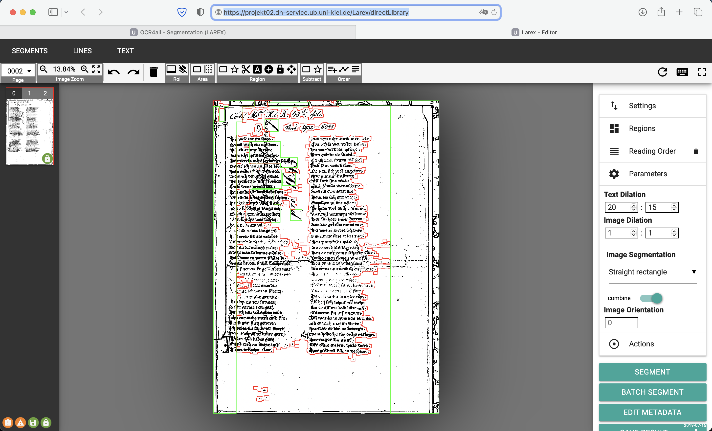

<div style="text-align: justify"> Im Fall der Crône wird die Quelldatei eingelesen und in Abschnitte unterteilt. Der Computer erkennt, wo sich auf einem Blatt Text befindet. In einem zweiten Schritt erkennt er dann Zeichen für Zeichen und gibt als Endprodukt eine Textdatei aus, die einen unformatierten Text enthält. Das Erkennungsmodell kann man trainieren, so dass der Computer die einzelnen Zeichen mit jedem Durchgang besser erkennt.</div>


## Kodierung

### XML

<div style="text-align: justify"> Um einen Text maschinenlesbar zu machen, reicht es nicht, alle Zeichen des Textes digital zu speichern. Der Schwachpunkt von Maschinen liegt darin, dass sie die Bedeutung von Texten nicht erkennen. Daher benötigt man für eine gute Maschinenlesbarkeit neben dem reinen Text auch Element, die der Maschine die Bedeutung des jeweiligen Textes übermitteln. Dazu wurde eine Programmiersprache[^1] entwickelt, die der Maschine die Bedeutung übermitteln kann – XML E**x**tensible **M**arkup **L**anguage (dt. Erweiterbare Auszeichnungssprache). Das funktioniert dann so: </div> 

<div style="text-align: justify"> Wenn wir einen Satz in einem Text haben (bspw. Tom ging baden.), dann erkennt eine Maschine alle Zeichen/Buchstaben der einzelnen Wörter aber ihr fehlt noch deren Bedeutung. In XML fügt man daher dem Text sogenannte Tags hinzu. Tags sind Auszeichnungselemente, die in den Text hineigeschrieben werden, um der Maschine die Bedeutung zu übermitteln. Damit die Maschine (und auch die Menschen) diese zusätzlichen Informationen nicht mit dem eigentlichen Text verwechseln, werden sie in Spitzklammern notiert <Tagname>Text</Tagname>. Es gibt immer ein Anfangstag und ein Endtag. Damit die Maschine die Tags voneinander unterscheiden kann, wird dem Endtag ein / (Slash) hinzugefügt. Mit XML können wir dem Satz _Tom ging baden._ weitere Bedeutungen hinzufügen. </div>

<div style="text-align: justify"> `<s>Tom ging baden.</s>` Das <s>-Tag (s für engl. sentence) markiert den Satz als Satz. Die Maschine wäre damit in der Lage, alle Sätze eines Textes zu finden. </div>

<div style="text-align: justify"> `<s><w>Tom</w> <w>ging</w> <w>baden</w>.</s>` Wenn wir zusätzlich dazu alle Wörter mit dem <w>-Tag umklammern (w wie engl. word), ist die Maschine in der Lage nicht nur die Sätze, sondern auch die Wörter zu erkennen. Sie wäre sofort in der Lage, in einem sehr langen Text zu sagen, wie viele Wörter in jedem Satz sind und wie viele Wörter der durchschnittliche Satz eines bestimmten Autors hat. </div>

<div style="text-align: justify"> Auf diese Weise können wir alle möglichen Phänomene beschreiben, nicht nur Texte. XML ist dafür gemacht, erweiterbar zu sein. Man könnte theoretisch auch ein Zimmer beschreiben und sich dafür Tags wie <zimmer>, <tisch> und <stuhl> erschaffen. </div>

### TEI XML

<div style="text-align: justify"> Da XML beliebig erweiterbar ist, liegt es nahe, für die Beschreibung spezieller Gegenstände Standards zu definieren. Wenn wir ein Zimmer beschreiben wollten, dann bräuchten wir bestimmte Tags wie <zimmer>, <tisch> und <stuhl> usw. Sobald wir diese Beschreibung aber nicht für uns selbst, sondern auch mit anderen machen, macht es Sinn, sich auf bestimmte Tags zu einigen. Man würde also einen Beschreibungsstandard für Zimmer entwickeln, der bestimmte Tags erlaubt und andere ausschließt. So würde man sicherstellen, dass alle Zimmer auf dieselbe Art beschrieben werden und miteinander vergleichbar sind. </div>

<div style="text-align: justify"> Die Text Encoding Initiative[^1], ein 1987 gegründetes Konsortium, hat genau dies zur Auszeichnung von Texten der Kultur- und Geisteswissenschaften entwickelt. Sie gibt Richtlinien (Guidelines) heraus, die eine umfassende Liste an Tags bereitstellen, um geisteswissenschaftliche Texte zu beschreiben. Der von ihnen herausgegebene Standard heißt TEI und ist nach eben jenem Konsortium benannt. </div>

<div style="text-align: justify"> XML- und TEI-Dateien werden als normale Textdateien aber mit der Endung .xml statt .txt für Textdateien gespeichert. Sie lassen sich dadurch auf allen Plattformen (Windows, MacOS, Linux etc.) ohne den Einsatz proprietärer[^2] Software öffnen und bearbeiten. XML-Dateien belegen wenig Speicherplatz. Sie sind damit langfristig verfügbar und können einfach ausgetauscht werden. </div>

[^1]: [https://tei-c.org](https://tei-c.org)
[^2]: Proprietär bezeichnet man Software oder Technologien, die an einen Hersteller gebunden sind. Sie sind in der Regel urheberrechtlich geschützt und damit im nicht frei verfügbar. Beispiele solcher Software sind Microsoft Word© und Adobe Photoshop©.

### TEI Module

TEI besteht in seiner aktuellen Fassung P5 (Proposal 5) aus dem Jahr 2007 aus rund 500 Elementen, die in 22 Module eingeteilt sind.

<!-- data-type="none" -->
| Module name   | Formal public identifier             | Where defined                                                                                               |
| ------------- | ------------------------------------ | ----------------------------------------------------------------------------------------------------------- |
| analysis      | Analysis and Interpretation          | [17 Simple Analytic Mechanisms](https://tei-c.org/release/doc/tei-p5-doc/en/html/AI.html)                   |
| certainty     | Certainty and Uncertainty            | [21 Certainty, Precision, and Responsibility](https://tei-c.org/release/doc/tei-p5-doc/en/html/CE.html)     |
| core          | Common Core                          | [3 Elements Available in All TEI Documents](https://tei-c.org/release/doc/tei-p5-doc/en/html/CO.html)       |
| corpus        | Metadata for Language Corpora        | [15 Language Corpora](https://tei-c.org/release/doc/tei-p5-doc/en/html/CC.html)                             |
| dictionaries  | Print Dictionaries                   | [9 Dictionaries](https://tei-c.org/release/doc/tei-p5-doc/en/html/DI.html)                                  |
| drama         | Performance Texts                    | [7 Performance Texts](https://tei-c.org/release/doc/tei-p5-doc/en/html/DR.html)                             |
| figures       | Tables, Formulae, Figures            | [14 Tables, Formulæ, Graphics, and Notated Music](https://tei-c.org/release/doc/tei-p5-doc/en/html/FT.html) |
| gaiji         | Character and Glyph Documentation    | [5 Characters, Glyphs, and Writing Modes](https://tei-c.org/release/doc/tei-p5-doc/en/html/WD.html)         |
| header        | Common Metadata                      | [2 The TEI Header](https://tei-c.org/release/doc/tei-p5-doc/en/html/HD.html)                                |
| iso-fs        | Feature Structures                   | [18 Feature Structures](https://tei-c.org/release/doc/tei-p5-doc/en/html/FS.html)                           |
| linking       | Linking, Segmentation, and Alignment | [16 Linking, Segmentation, and Alignment](https://tei-c.org/release/doc/tei-p5-doc/en/html/SA.html)         |
| msdescription | Manuscript Description               | [10 Manuscript Description](https://tei-c.org/release/doc/tei-p5-doc/en/html/MS.html)                       |
| namesdates    | Names, Dates, People, and Places     | [13 Names, Dates, People, and Places](https://tei-c.org/release/doc/tei-p5-doc/en/html/ND.html)             |
| nets          | Graphs, Networks, and Trees          | [19 Graphs, Networks, and Trees](https://tei-c.org/release/doc/tei-p5-doc/en/html/GD.html)                  |
| spoken        | Transcribed Speech                   | [8 Transcriptions of Speech](https://tei-c.org/release/doc/tei-p5-doc/en/html/TS.html)                      |
| tagdocs       | Documentation Elements               | [22 Documentation Elements](https://tei-c.org/release/doc/tei-p5-doc/en/html/TD.html)                       |
| tei           | TEI Infrastructure                   | [1 The TEI Infrastructure](https://tei-c.org/release/doc/tei-p5-doc/en/html/ST.html)                        |
| textcrit      | Text Criticism                       | [12 Critical Apparatus](https://tei-c.org/release/doc/tei-p5-doc/en/html/TC.html)                           |
| textstructure | Default Text Structure               | [4 Default Text Structure](https://tei-c.org/release/doc/tei-p5-doc/en/html/DS.html)                        |
| transcr       | Transcription of Primary Sources     | [11 Representation of Primary Sources](https://tei-c.org/release/doc/tei-p5-doc/en/html/PH.html)            |
| verse         | Verse                                | [6 Verse](https://tei-c.org/release/doc/tei-p5-doc/en/html/VE.html)                                         |

<div style="text-align: justify"> Jedes der Module stellt eine Reihe von Elementen zur Verfügung, mit denen ein Text ausgezeichnet werden kann. Die Module tei, header, core und textstructure enthalten beispielsweise die grundlegende Struktur eines TEI-Dokuments: </div>

```xml
<TEI>
  <teiHeader>
    <fileDesc>
      <titleStmt>
        <title>Dies ist ein Titel</title>
      </titleStmt>
    </fileDesc>
  </teiHeader>
  <text>
    <body>
      ...    
    </body>
  </text>
</TEI>      
```
<div style="text-align: justify"> Es wird ein Header definiert, der Metainformationen enthält, und ein Textbereich für die Textdaten. Diese können mit den Elementen für diverse Textsorten wie Handschrift (msdescription), Drama (drama), Lyrik (verse), Gesprochene Sprache (spoken) oder Wörterbuch (dictionaries) erstellt werden. Jedes der entsprechenden Module enthält Elemente für Phänomene der jeweiligen Textsorte. </div>

<div style="text-align: justify"> Zusätzlich dazu definiert TEI Elemente für die Auszeichnung von Namen (namedates), Bildern (figures), Tabellen (nets) und Interpretationen (analysis). </div>

<div style="text-align: justify"> Zu den Metadaten im Header gehören die bibliografische Beschreibung der Datei (fileDesc), Informationen über das Verhältnis des elektronischen Textes zu seiner Quelle (encodingDesc), die nicht bibliographische Beschreibung der Datei (profileDesc) und Dateirevisionen (revisionDesc). </div>

### Kodierung der Crone

<div style="text-align: justify"> Im gezeigten Beispiel muss die Quelldatei der Crône codiert werden. Die Analyse hatte ergeben, dass dafür unter anderem l-Elemente für die Verse nötig sind. Diese werden nun mithilfe eines XML Editors in den Text eingetragen. Jeder Vers wird als mit einem l-Tag umklammert. Dazu bekommt er ein Attribut (in diesem Fall n für die Versnummer). Auf dieselbe Weise werden auch alle anderen Textelemente kodiert, so etwa Spalten (pb), Zeilenumbrüche (lb), Lombarden (hi type=lombarde) und Initialen (hi type=initiale).</div>

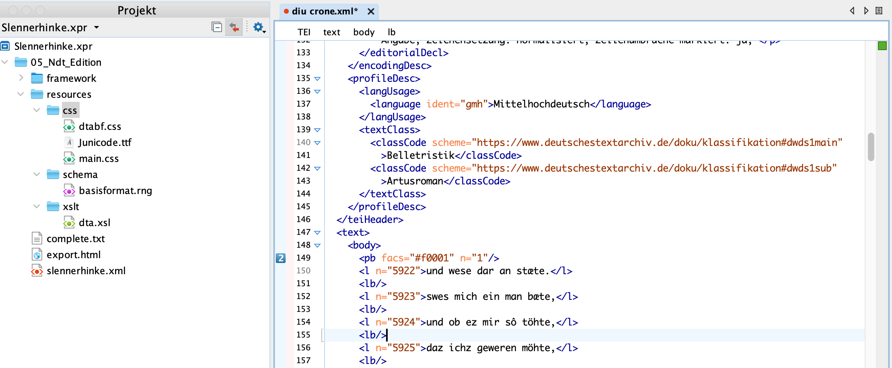

<div style="text-align: justify"> Der Text sieht in der XML-Ansicht dann so aus:</div>

```xml
  <text>
    <body>
      <pb facs="#f0001" n="1"/>
      <l n="5922">und wese dar an stæte.</l>
      <lb/>
      <l n="5923">swes mich ein man bæte,</l>
      <lb/>
      <l n="5924">und ob ez mir sô töhte,</l>
      <lb/>
      <l n="5925">daz ichz geweren möhte,</l>
      <lb/>
      ...
    </body>
  </text>     
```
<div style="text-align: justify">Zusätzlich zum Text werden auch alle Metadaten kodiert. Die XML-Datei enthält damit auch alle relevanten Zusatzinformationen zum Text und dessen Quellen.</div>

```xml
<TEI>
  <teiHeader>
    <fileDesc>
      <titleStmt>
        <title type="main">Diu Crône</title>
        <author>
          <persName ref="http://d-nb.info/gnd/118548352">
            <surname>von dem Türlin</surname>
            <forename>Heinrich</forename>
          </persName>
        </author>
        <respStmt xml:id="textsource-1" corresp="#availability-textsource-1">
          <orgName>Universitätsbibliothek Kiel</orgName>
          <resp>
            <note type="remarkResponsibility">Bereitstellung der Texttranskription.</note>
            <note type="remarkRevisionDTA">Bitte beachten Sie, dass die aktuelle Transkription (und
              Textauszeichnung) mittlerweile nicht mehr dem Stand zum Zeitpunkt der Übernahme des
              Werkes in das DTA entsprechen muss.</note>
            <ref target="https://nbn-resolving.org/urn:nbn:de:gbv:8:2-1698427"/>
            <date type="importDTA">2023-04-28T10:07:30Z</date>
          </resp>
        </respStmt>
        <respStmt>
          <persName>
            <surname>Diebel</surname>
            <forename>Richard</forename>
          </persName>
          <resp>
            <note type="remarkResponsibility">Bearbeitung der digitalen Edition.</note>
            <date type="importDTA">2023-04-28T10:07:30Z</date>
          </resp>
        </respStmt>
        <respStmt>
          <orgName ref="https://www.bbaw.de">Berlin-Brandenburgische Akademie der Wissenschaften
            (BBAW)</orgName>
          <resp>
            <note type="remarkResponsibility">Langfristige Bereitstellung der DTA-Ausgabe</note>
            <ref target="https://www.bbaw.de"/>
          </resp>
        </respStmt>
      </titleStmt>
      <editionStmt>
        <edition>Vollständige digitalisierte Ausgabe.</edition>
      </editionStmt>
      <extent>
        <measure type="images"/>
        <measure type="tokens"/>
        <measure type="types"/>
        <measure type="characters"/>
      </extent>
      <publicationStmt>
        <publisher xml:id="DTACorpusPublisher">
          <email>dta@bbaw.de</email>
          <orgName role="project">Deutsches Textarchiv</orgName>
          <orgName role="hostingInstitution" xml:lang="en">Berlin-Brandenburg Academy of Sciences
            and Humanities (BBAW)</orgName>
          <orgName role="hostingInstitution" xml:lang="de">Berlin-Brandenburgische Akademie der
            Wissenschaften (BBAW)</orgName>
          <address>
            <addrLine>Jägerstr. 22/23, 10117 Berlin</addrLine>
            <country>Germany</country>
          </address>
        </publisher>
        <pubPlace>Berlin</pubPlace>
        <date type="publication">2023-04-28T10:07:30Z</date>
        <availability xml:id="availability-textsource-1" corresp="#textsource-1">
          <licence target="http://creativecommons.org/publicdomain/zero/1.0/">
            <p>Dieses Werk ist gemeinfrei.</p>
          </licence>
          <p>https://creativecommons.org/publicdomain/mark/1.0/deed.de</p>
        </availability>
        <availability xml:id="availability-imagesource-1" corresp="#imagesource-1">
          <licence target="http://creativecommons.org/publicdomain/zero/1.0/">
            <p>Dieses Werk ist gemeinfrei.</p>
          </licence>
        </availability>
      </publicationStmt>
      <sourceDesc>
        <bibl type="M"/>
        <biblFull>
          <titleStmt>
            <title level="m" type="main">Diu Crône</title>
            <author>
              <persName ref="http://d-nb.info/gnd/118548352">
                <surname>von dem Türlin</surname>
                <forename>Heinrich</forename>
              </persName>
            </author>
          </titleStmt>
          <editionStmt>
            <edition n="1"/>
          </editionStmt>
          <publicationStmt>
            <publisher/>
          </publicationStmt>
        </biblFull>
        <msDesc xml:id="imagesource-1" corresp="#availability-imagesource-1">
          <msIdentifier>
            <repository>Universitätsbibliothek Kiel</repository>
            <idno>
              <idno type="shelfmark">Cod. ms. KB 48l</idno>
              <idno type="URLCatalogue"
                >https://katalog.ub.uni-kiel.de/DB=1/LNG=DU/PPN?PPN=743860756</idno>
              <idno type="URLImages"
                >https://dibiki.ub.uni-kiel.de/viewer/image/PPN743860756/1/</idno>
              <idno type="URN">urn:nbn:de:gbv:8:2-1698463</idno>
            </idno>
          </msIdentifier>
          <physDesc>
            <typeDesc>
              <p>Textur</p>
            </typeDesc>
          </physDesc>
        </msDesc>
      </sourceDesc>
    </fileDesc>
    <encodingDesc>
      <editorialDecl>
        <p>Die Transkription erfolgte nach den unter <ref
            target="https://www.deutschestextarchiv.de/doku/basisformat/"
            >https://www.deutschestextarchiv.de/doku/basisformat/</ref> formulierten
          Richtlinien.</p>
        <p>Verfahren der Texterfassung: manuell (einfach erfasst).</p>
        <p> Bogensignaturen: nicht gekennzeichnet; Druckfehler: keine Angabe; fremdsprachliches
          Material: keine Angabe; Geminations-/Abkürzungsstriche: wie Vorlage; Hervorhebungen
          (Antiqua, Sperrschrift, Kursive etc.): gekennzeichnet; I/J in Fraktur: Lautwert
          transkribiert; i/j in Fraktur: Lautwert transkribiert; Kolumnentitel: nicht
          gekennzeichnet; Kustoden: nicht gekennzeichnet; langes s (ſ): als s transkribiert;
          Normalisierungen: stillschweigend; rundes r (&amp;#xa75b;): als r/et transkribiert;
          Seitenumbrüche markiert: ja; Silbentrennung: aufgelöst; u/v bzw. U/V: Lautwert
          transkribiert; Vokale mit übergest. e: als ä/ö/ü transkribiert; Vollständigkeit: keine
          Angabe; Zeichensetzung: normalisiert; Zeilenumbrüche markiert: ja; </p>
      </editorialDecl>
    </encodingDesc>
    <profileDesc>
      <langUsage>
        <language ident="gmh">Mittelhochdeutsch</language>
      </langUsage>
      <textClass>
        <classCode scheme="https://www.deutschestextarchiv.de/doku/klassifikation#dwds1main"
          >Belletristik</classCode>
        <classCode scheme="https://www.deutschestextarchiv.de/doku/klassifikation#dwds1sub"
          >Artusroman</classCode>
      </textClass>
    </profileDesc>
  </teiHeader>
</TEI>      
```

## Publikation

<div style="text-align: justify"> Da in digitalen Editionen alle Daten nach dem Single-Source-Prinzip in einer Quelle vorliegen, lassen sie sich auf unterschiedliche Art publizieren. Die herkömmliche Edition wurde als **Buch** publiziert, welches gesetzt, gedruckt und vertrieben werden musste. Auch digitale Editionen lassen sich so publizieren, da sich die Daten leicht in der herkömmlichen Art und Weise ausgeben lassen bspw. als PDF bzw. Dokument, welches für den Druck geeignet ist. Dabei gehen jedoch zwangsläufig Informationen verloren, da die Daten wieder dem technischen Beschränkungen des Buchdrucks unterliegen. Man ist auf eine feste Seitengröße reduziert, Bilder sind teuer und aufwändig, Links können nicht angeklickt werden und der Text kann im Nachhinein nicht verändert werden. </div>

<div style="text-align: justify"> Digitale Editionen werden daher fast immer digital publiziert. Dies kann als reine Veröffentlichung der **Daten** geschehen. Dafür wird eine [Programmierschnittstelle (API)](https://www.digitale-edition.at/o:konde.31) zur Verfügung gestellt über die die Daten abgerufen werden können. So lassen sich beispielsweise die Daten zur Handschrift Cpg 639, die auf dem Handschriftencensus die Rohdaten über folgenden Link im JSON-Format abrufen: </div>

[https://handschriftencensus.de/10435.json](https://handschriftencensus.de/10435.json)

<div style="text-align: justify"> Diese Rohdaten lassen sich ganz unterschiedlich aufbereiten. Der häufigste Fall ist die **digitale Publikation** in Form einer Internetplattform, die die volle Bandbreite der Daten in einer anwenderfreudlichen und interaktiven Form zugänglich macht. Im Falle der Handschrift Cpg 639 aus dem Handschriftencensus werden die Daten in HTML formatiert und auf einer durchsuchbaren Plattform bereit gestellt. </div>

[https://handschriftencensus.de/10435](https://handschriftencensus.de/10435)

Transformationssprachen
-----------------------

<div style="text-align: justify"> Es existieren eine Reihe von standardisierten Technologien, um XML-kodierte Daten zu publizieren. Dafür steht [XSLT](https://www.digitale-edition.at/o:konde.86) (**E**xtensible **S**tylesheet **L**anguage **T**ransformations) zur Verfügung, welche XML-Daten in HTML konvertieren kann, welches Webbrowser darstellen können. Eine XSLT-Datei ist eine Textdatei mit der Endung .xsl, die Anweisungen enthält, wie ein XML-Element in HTML aussehen soll. </div>

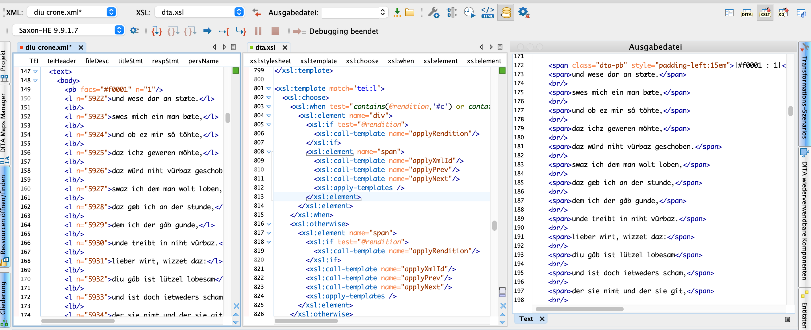


<div style="text-align: justify"> Für die Darstellung im Web wird auf die Sprache CSS (**C**ascading **S**tyle **S**heets) zurückgegriffen, die sich als Standard für die Darstellung von HTML im Web durchgesetzt hat. CSS-Dateien sind Textdateien mit der Endung .css, die Anweisungen enthalten, wie bestimmte HTML Elemente von einem Browser dargestellt werden sollen. Die Anweisung, einen Absatz (_p_) in roter Farbe darzustellen, sieht in CSS folgendermaßen aus: </div>

```css
p {
  color: red;
}      
```

Endprodukt Website
----------

<div style="text-align: justify"> Wenn die TEI-Datei in HTML transformiert wurde, lässt sie sich mit einem beliebigen Webbrowser darstellen. Für das hier gezeigte Beispiel sähe eine Ansicht wie folgt aus. Der Text ist im Vergleich zu Handschrift in klaren, lateinischen Buchstaben dargestellt und beliebig modifizierbar. Spalten sind markiert. Lombarden und die Initiale wurden farbig hervorgehoben. Von dieser Grundlage aus lassen sich alle weiteren Zugänge zum Text einrichten. Die digitale Edition ist erstellt.</div>

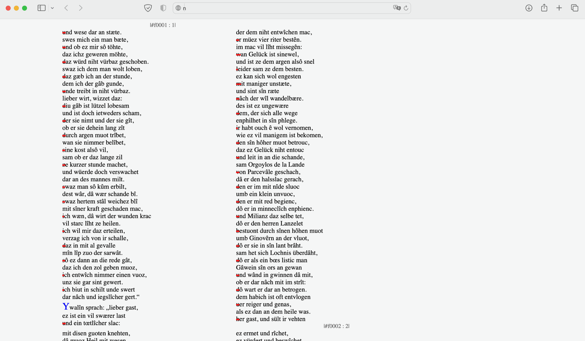